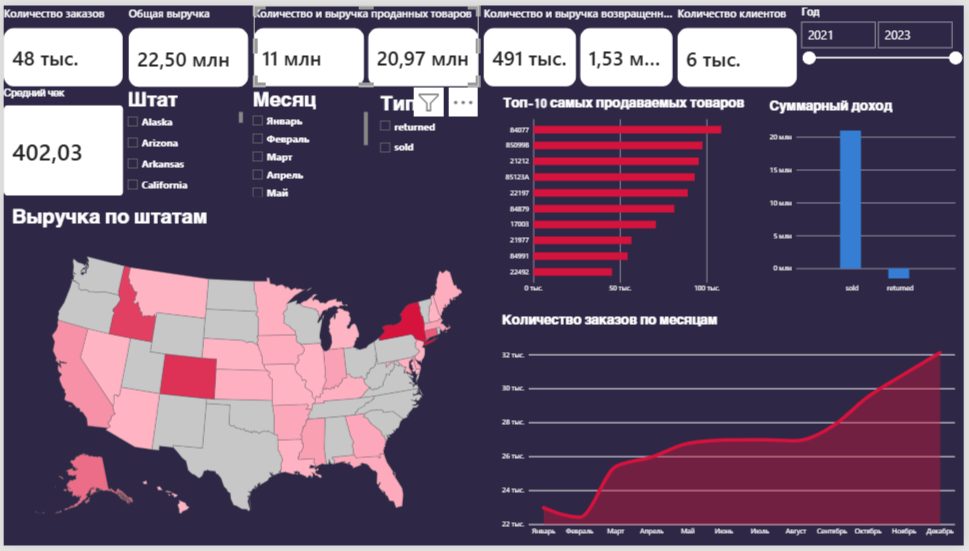

# Анализ заказов онлайн магазина США
# Online Retail — SQL Analysis & Power BI Dashboard

Аналитический проект по исследованию данных интернет-магазина с использованием **PostgreSQL** и **Power BI**.

Проект включает SQL-анализ данных, создание пользовательской функции и интерактивный дашборд с ключевыми показателями продаж.

## 📊 Dashboard

Дашборд создан в Power BI и позволяет анализировать основные показатели интернет-магазина:

- Общая выручка
- Количество продаж
- Средний чек
- Динамика продаж
- Анализ товаров
- Анализ по странам
- Основные показатели эффективности

## 🛠 Используемые технологии

- **PostgreSQL** — обработка и анализ данных
- **SQL** — запросы, агрегации, оконные функции и аналитика
- **Power BI** — визуализация и создание интерактивного дашборда
- **DAX** — расчёт аналитических показателей

## 🔎 SQL Analysis

В файле `online_retail_SQL_Analysis.sql` представлены SQL-запросы для анализа данных интернет-магазина.

## ⚙️ SQL Function

Файл `function.sql` содержит хранимые функции, написанные на языке plpgsql.

Функции позволяют получить такие показатели, как:

- количество проданных товаров;
- количество возвращённых товаров;
- выручка;
- доля выручки.

## 📈 Power BI

На основе подготовленных данных создан интерактивный Power BI-дашборд.

Дашборд предназначен для быстрого анализа:

- финансовых показателей;
- объёма продаж;
- среднего чека;
- динамики продаж;
- наиболее важных категорий и товаров.

## 🎯 Цель проекта

Цель проекта — продемонстрировать навыки работы с данными на разных этапах аналитического процесса:

**SQL → Анализ данных → Расчёт показателей → Power BI → Визуализация**
