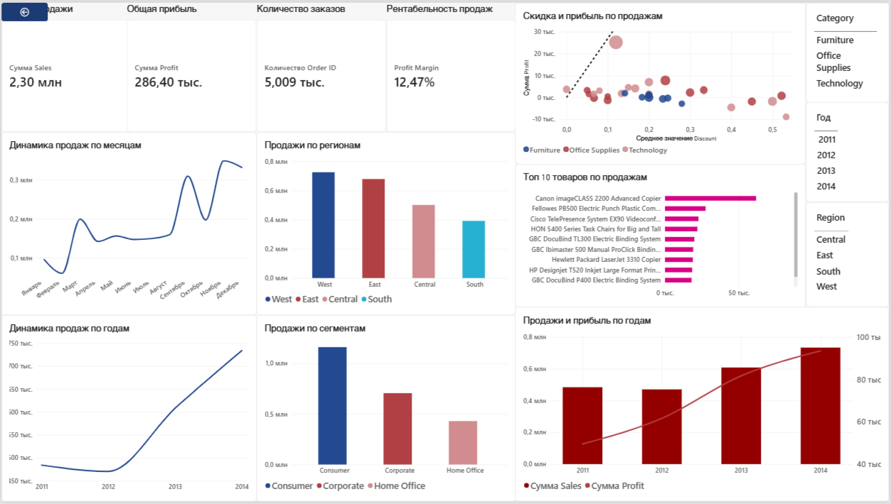

# Superstore Sales Analysis | PostgreSQL & Power BI

Аналитический проект по исследованию продаж интернет-магазина на основе датасета Superstore.

Проект показывает полный путь от загрузки и анализа данных в PostgreSQL до визуализации результатов в Power BI: расчёт бизнес-KPI, анализ продаж и прибыли, исследование клиентов, товаров, регионов, скидок и временной динамики.

## О проекте

Цель проекта — проанализировать датасет и ответить на следующие вопросы:

- сколько выручки и прибыли генерирует бизнес;
- какие категории, подкатегории, регионы и клиенты дают основной вклад;
- как скидка связана с выручкой и прибыльностью;
- какие клиенты покупают чаще и приносят больше денег;
- как меняется выручка и прибыль во времени;
- какие товары формируют основную часть оборота;
- как результаты SQL-анализа можно представить в интерактивном Power BI-дашборде.

## Стек

- **PostgreSQL**
- **Power BI**

## Данные

Используется датасет *Superstore* с информацией о заказах, клиентах, товарах, категориях, регионах, скидках, продажах и прибыли.

Основные поля:

| Поле | Назначение |
|---|---|
| `order_id` | идентификатор заказа |
| `order_date` | дата заказа |
| `ship_date` | дата отправки |
| `ship_mode` | способ доставки |
| `customer_id` | идентификатор клиента |
| `customer_name` | имя клиента |
| `segment` | клиентский сегмент |
| `region` | регион |
| `category` | категория товара |
| `sub_category` | подкатегория |
| `product_name` | товар |
| `sales` | выручка |
| `quantity` | количество единиц |
| `discount` | скидка |
| `profit` | прибыль |

## SQL-анализ

SQL-часть проекта выполняется в PostgreSQL и включает несколько уровней анализа.

### 1. Подготовка данных

Создаётся таблица `superstore`, после чего данные загружаются в PostgreSQL.

### 2. Базовые бизнес-KPI

Рассчитываются:

- выручка;
- прибыль;
- средняя продажа;
- средняя скидка;
- количество заказов;
- количество уникальных клиентов.

### 3. Анализ бизнеса по разрезам

Исследуются:

- способы доставки;
- клиентские сегменты;
- категории и подкатегории товаров;
- регионы;
- отдельные товары;
- крупнейшие и наименее прибыльные клиенты и продукты.

### 4. Оконные функции

В проекте показаны практические сценарии использования:

- `RANK()` — ранжирование регионов и категорий;
- `ROW_NUMBER()` — ранжирование клиентов и товаров внутри групп;
- `NTILE(4)` — разделение клиентов на четыре группы по выручке;
- `LAG()` — сравнение текущего значения с предыдущим;
- `SUM() OVER()` — накопительная выручка и доля категории в общей выручке.

### 5. Временной анализ

Рассчитываются месячная выручка и прибыль, рост выручки месяц к месяцу и накопительные показатели.

### 6. Анализ скидок

Исследуется зависимость между размером скидки, выручкой, прибылью и маржинальностью.

### 7. Анализ клиентов

Рассчитываются:

- Average Order Value (AOV);
- количество заказов на клиента;
- распределение клиентов по частоте покупок;
- доля повторных клиентов;
- квартильные группы клиентов по выручке.

### 8. ABC-анализ товаров

Товары распределяются на группы:

- **A** — первые 80% накопленной выручки;
- **B** — следующие 15%;
- **C** — оставшиеся 5%.

### 9. Когортный анализ

Клиенты объединяются по году первой покупки. Для каждой когорты рассчитываются выручка, прибыль и количество заказов.

> В текущей версии реализована когортная структура и итоговая ценность когорт, но не полноценный retention-анализ по месяцам после первой покупки.

## Power BI Dashboard

Результаты анализа дополнительно визуализированы в интерактивном Power BI-дашборде.

Дашборд позволяет анализировать:

- общую выручку;
- общую прибыль;
- количество заказов;
- рентабельность продаж;
- динамику продаж во времени;
- продажи и прибыль по годам;
- продажи по регионам;
- прибыль по регионам;
- продажи по сегментам;
- Top-10 товаров по продажам;
- связь между скидкой и прибылью;
- результаты через интерактивные фильтры по категории, региону и году.

### Основные KPI

- **Sales:** 2,30 млн
- **Profit:** 286,40 тыс.
- **Orders:** 5 009
- **Profit Margin:** 12,47%

### Power BI-файл

Файл дашборда находится в репозитории:

`superstore_dashboard.pbix`

### Превью дашборда

